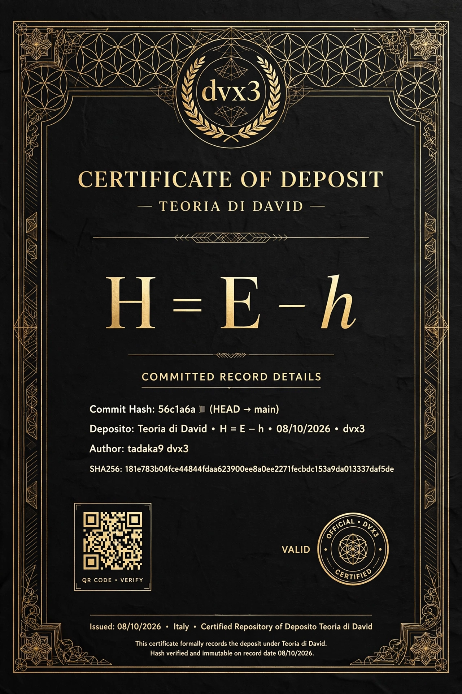

# Teoria di David - H = E - h
**Author:** Davide dvx3 / tadaka9 - 08/10/2026 Italy
**Commit:** 56c1a6a (HEAD -> main)
**SHA256:** 181e783b04fce44844fdaa623900ee8a0ee2271fecbdc153a9da013337daf5de

## Formula
H = E - h
E = multi-factor energy (volatility + volume + range)
h = (EMA9 + EMA50 + VWAP)/3

## Certificato

## Licenza
CC BY-NC-ND 4.0 - © 2026 dvx3 - Uso commerciale solo su autorizzazione.
Contatto: github.com/tadaka9

## Verifica
git log --oneline -1 -> 56c1a6a
sha256sum david-theory.pdf
